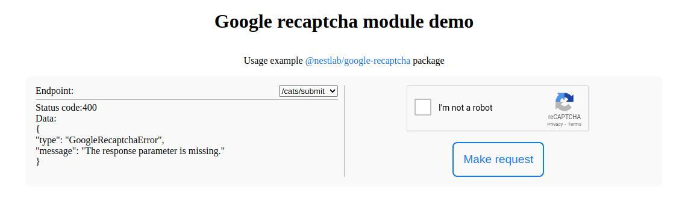

# Google recaptcha example

Example usage [@nestlab/google-recaptcha](https://www.npmjs.com/package/@nestlab/google-recaptcha)

Google recaptcha [admin console](https://www.google.com/recaptcha/about/)



**Installation**

```bash
$ npm i
```

**Running the app**

```bash
$ npm run start
```
